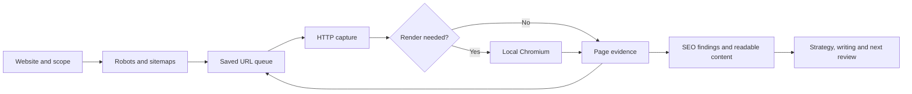

<p align="center">
  
</p>

<p align="center">
  <strong>Understand your website. Strengthen your answers. Build evidence people can trust.</strong><br>
  A complete SEO workflow with its own crawler, reputation system and specialist playbooks.
</p>

<p align="center">
  <a href="https://github.com/beyondtahir/beyondseo/actions/workflows/tests.yml"></a>
  <a href="CHANGELOG.md"></a>
  <a href="docs/setup.md"></a>
  <a href="docs/questions.md#does-it-need-tokens-apis-or-paid-scraping-services"></a>
  <a href="#project-status"></a>
  <a href="LICENSE"></a>
</p>

<p align="center">
  <a href="#quick-start"><strong>Quick start</strong></a> ·
  <a href="docs/agent-installation.md"><strong>Install the skill</strong></a> ·
  <a href="docs/README.md"><strong>Documentation</strong></a> ·
  <a href="docs/questions.md"><strong>Questions & examples</strong></a> ·
  <a href="#about-the-creator"><strong>About</strong></a>
</p>

---

## Research that explains its evidence

BeyondSEO now checks what a business actually offers before comparing it. Shared search discovery can use native public search, available assistant search tools, saved results or supplied URLs. Failed sources retain their diagnostics and fall back where access is permitted. Candidate pages are checked by the crawler; snippets never count as backlinks.

Business profiles separate services, customers, offices, markets and languages. Competitor selection shows its criteria, supporting pages, important differences and rejected candidates. Audit findings include the affected URL, captured evidence, action and a practical acceptance check. Partial captures stay partial.

Read the [step-by-step research guide](docs/discovery-and-competitors.md) and [host-specific failure guidance](docs/discovery-diagnostics.md). No paid SEO API is required; search access and host permissions still vary.

## Your complete SEO house

BeyondSEO connects the work that normally gets scattered across separate audits, content briefs, backlink spreadsheets and follow-up reports. Give it a website and a business goal. It helps you inspect the site, understand the gaps, compare relevant competitors, write useful content and build a practical improvement plan.

**SEO · AEO · GEO · Entity · Authority · Reputation · Local visibility · Backlinks · Conversion**

The native Python engine gathers evidence. The reusable skill brings specialist methods and business context. Together, they support the work from the first crawl to the next review.

<table>
<tr>
<td width="50%" valign="top">
<h3>01 · Inspect the website</h3>
<p>Read sitemaps, raw HTML and JavaScript content. Keep page text, metadata, schema observations, links and access evidence.</p>
</td>
<td width="50%" valign="top">
<h3>02 · Explain what matters</h3>
<p>Turn findings into clear priorities. Connect technical problems, unanswered questions and missing proof to the customer's journey.</p>
</td>
</tr>
<tr>
<td width="50%" valign="top">
<h3>03 · Build answer-ready content</h3>
<p>Draft useful answers, service pages, FAQs, internal links and factual schema. Strengthen organization identity and topical depth.</p>
</td>
<td width="50%" valign="top">
<h3>04 · Verify reputation</h3>
<p>Check real backlinks and page mentions. Review sources, distinguish ownership and calculate a conservative evidence score.</p>
</td>
</tr>
<tr>
<td width="50%" valign="top">
<h3>05 · Make the plan actionable</h3>
<p>Compare named competitors and create a 30/60/90-day roadmap with priorities, dependencies and acceptance checks.</p>
</td>
<td width="50%" valign="top">
<h3>06 · Improve and review</h3>
<p>Compare fresh snapshots, run bounded review loops and apply reviewed text-file changes with backups on compatible hosting.</p>
</td>
</tr>
</table>

[Explore every capability →](references/capabilities.md)

## Install in your assistant

**Choose your app and follow its short guide.** The skill includes the SEO workflows, backlink library and native crawler.

[ChatGPT Work](docs/agent-installation.md#chatgpt-work) · [Claude](docs/agent-installation.md#claude-website-and-desktop-skills) · [Claude Code](docs/agent-installation.md#claude-code) · [Codex](docs/agent-installation.md#codex) · [Hermes](docs/agent-installation.md#hermes-agent) · [OpenClaw](docs/agent-installation.md#openclaw)

**[Download the complete source folder](https://github.com/beyondtahir/beyondseo/archive/refs/heads/main.zip)** · [Release packages](https://github.com/beyondtahir/beyondseo/releases/latest) · [What it installs and accesses](docs/permissions.md)

For Claude uploads, use a matching `beyondseo-<version>-skill.zip` release asset when available, or create the correctly structured upload with the single command in the guide. GitHub’s source ZIP is for extracting, not direct skill upload. Windows users can extract the source and follow the local assistant guide without installing Git. ChatGPT Work has its own skill-save workflow; the guide includes a copy-paste installation request and help for save errors and runtime permissions.

### Prefer to let your assistant install it?

Paste this into your assistant:

```text
Install BeyondSEO from https://github.com/beyondtahir/beyondseo in the
assistant I am using. Follow docs/agent-installation.md for this host.
Use the complete skill bundle, register it through this app's supported
skill controls, and confirm it appears in my Skills list.
Set up the native crawler in a permitted execution environment and run
doctor. Report skill registration, HTTP readiness and browser readiness
separately. If a step fails, show the exact error and resolve that step.

```

Use the [step-by-step guide](docs/agent-installation.md) for the upload route or exact CLI command for your app. Saving a skill and preparing its crawler are separate steps.

## Run the crawler from a terminal

You need **Python 3.10+** and Git. Python **3.12** is recommended. Run these commands in a terminal:

```sh
git clone https://github.com/beyondtahir/beyondseo.git
cd beyondseo
python3 scripts/setup.py
python3 scripts/run.py crawl https://example.com --out ../client-runs/example --max-pages 10
```

Setup creates an isolated environment, installs the local engine and free PDF renderer, downloads Chromium and checks that it launches. The launcher automatically uses that environment, so you do not need to activate it each time.

<details>
<summary><strong>Windows PowerShell</strong></summary>

```powershell
git clone https://github.com/beyondtahir/beyondseo.git
cd beyondseo
py -3 scripts/setup.py
py -3 scripts/run.py crawl https://example.com --out ../client-runs/example --max-pages 10
```

Activation and a PowerShell execution-policy change are unnecessary when using the launcher.

</details>

<details>
<summary><strong>Linux browser dependencies or HTTP-only setup</strong></summary>

Minimal Linux systems may need Chromium's system packages. After setup has created `.venv`, use:

```sh
.venv/bin/python -m playwright install-deps chromium
python3 scripts/setup.py
```

For initial-HTML crawling without a browser:

```sh
python3 scripts/setup.py --http-only
python3 scripts/run.py crawl https://example.com --out ../client-runs/http --mode http
```

</details>

Open `../client-runs/example/report.md` for crawl findings and `readiness.md` for the next questions to review. Check `summary.json` for limits before interpreting results. A complete strategic audit follows the skill workflow below.

**No required crawling-service account. No SEO-data subscription. No API key for the native engine.** The CLI makes no language-model calls and consumes no model tokens. When an assistant analyzes evidence or writes copy, its own model usage still applies. [Costs and requirements](docs/questions.md#does-it-need-tokens-apis-or-paid-scraping-services).

[Full setup and troubleshooting →](docs/setup.md) · [Try the included practice website →](examples/README.md)

## Use it in your assistant

BeyondSEO uses a portable `SKILL.md` with bundled scripts, references and playbooks. Choose your host in the [installation guide](docs/agent-installation.md).

| Host | Where to begin |
|---|---|
| Claude website / desktop / Cowork | Upload the skill ZIP through Customize → Skills; enable BeyondSEO |
| Claude Code | `python3 scripts/install_skill.py --host claude-code --setup` |
| Codex | `python3 scripts/install_skill.py --host codex --setup` |
| ChatGPT Work | Follow the Work install prompt; confirm the saved skill and its runtime separately |
| Hermes Agent | `python3 scripts/install_skill.py --host hermes --setup` |
| OpenClaw | `python3 scripts/install_skill.py --host openclaw --setup` |
| Terminal / Python | Run the native engine directly, or import `Config` and `Crawler` |

For example, from this checkout, install a personal Claude Code skill:

```sh
python3 scripts/install_skill.py --host claude-code --setup
```

On Windows use `py -3` in place of `python3`. The installer supports `--dry-run` and safe updates with a backup. Hermes profiles and OpenClaw workspaces have explicit options. Hosted workers can use a separate approved runtime folder. [Exact paths, commands and acceptance checks →](docs/agent-installation.md)

### Ask for the whole engagement

```text
Use BeyondSEO to audit https://example.com.

We are based in Pakistan and serve clients in India, the UK, Europe
and Gulf countries. Explain where our website is strong, what is missing
and which improvements matter most for our actual services.

Include technical SEO, answer readiness, entity and authority work,
verified backlink evidence, three relevant competitors, useful content
drafts and a 30/60/90-day plan. Show uncertainty and give each task a
clear way to check the result.
```

A general website audit includes reputation evidence, named competitor comparisons and a practical plan by default. A focused writing or technical question keeps its narrower scope. [More questions you can ask →](docs/questions.md#what-should-i-ask-first)

## Why choose BeyondSEO?

| What matters | How BeyondSEO helps |
|---|---|
| One connected workflow | Technical analysis, content, answer readiness, reputation, competitors and follow-up share the same evidence |
| A crawler you can inspect | The Python source, request limits, extraction logic and saved observations are available together |
| Clear answers for clients | Reports explain what was found, why it matters and what to do next in everyday language |
| Useful content, not just recommendations | The skill can draft titles, answer sections, FAQs, schema and supporting copy using verified facts |
| Reputation with evidence | Actual links, mentions, ownership and unreadable candidates remain distinguishable |
| Conservative scoring | Unknown evidence cannot quietly become a high authority claim; clients and competitors use identical rules |
| Work you can continue | Saved snapshots, source lists, review plans and guarded edits support the next round of improvement |

BeyondSEO is a strong fit for evidence-based SEO engagements. It makes no unmeasured speed, ranking or accuracy claim against another crawler.

## How our crawler works



1. **Discover:** start from the URL, inspect robots and sitemaps, and collect in-scope links.
2. **Read:** fetch raw HTML and render JavaScript when automatic mode detects the need, or when browser mode is requested.
3. **Extract:** collect main text, Markdown, titles, headings, descriptions, canonicals, hreflang, images, links and JSON-LD observations.
4. **Explain:** retain errors, redirects, access decisions, incomplete rendering and coverage limits alongside findings.
5. **Continue:** save the queue in SQLite so an unfinished snapshot can resume. Start a fresh folder to measure changes later.

BeautifulSoup parses HTML; Colorama styles terminal feedback; optional Playwright runs local Chromium. The crawling workflow is implemented in this repository. No hosted scraping backend or external agent skill is required.

| Mode | Use it when |
|---|---|
| `auto` | Starting a general crawl; it uses HTTP first and heuristic browser fallback |
| `browser` | Important text or links arrive through JavaScript, even when the initial HTML already contains text |
| `http` | Inspecting the initial server response or running without Chromium |

Automatic mode is a heuristic. Browser mode supports visible-selector waits and bounded scrolling; neither guarantees every interactive state was captured. Robots rules are respected by default. An explicit owner-authorized override is recorded, but it does not bypass authentication, CAPTCHAs or server denials.

[Browser behavior →](docs/browser.md) · [Architecture and Python interface →](docs/architecture.md) · [All CLI options →](references/crawler.md)

<details>
<summary><strong>Useful crawler commands</strong></summary>

```sh
# Render an article and wait for its visible content.
python3 scripts/run.py scrape https://example.com/article \
  --out ../client-runs/article --mode browser --wait-for-selector article --scroll-steps 5

# Capture a browser viewport image.
python3 scripts/run.py scrape https://example.com --out ../client-runs/visual --screenshot

# Include an observed www alias when it is part of the website.
python3 scripts/run.py crawl https://example.com --allow-host www.example.com \
  --out ../client-runs/site --max-pages 25

# Continue that same snapshot with a larger budget.
python3 scripts/run.py crawl https://example.com --allow-host www.example.com \
  --out ../client-runs/site --max-pages 100 --resume
```

A resume keeps semantic settings and does not refresh completed pages. Choose a new folder for a new observation.

</details>

## Our backlink and reputation system

A reputation plan should distinguish a real link from a name in a snippet, a company profile from independent recognition, and an unreadable candidate from verified evidence.

BeyondSEO checks the agent's available browser and search tools, uses permitted native discovery fallbacks, and can import saved search results or supplied URLs/CSVs. Its crawler then inspects the source pages before counting links. Discovery serves both reputation research and business comparisons; it never supplies a complete backlink index.

```sh
python3 scripts/run.py discover --target https://example.com \
  --query '"Example" -site:example.com' --out ../client-runs/discovery

python3 scripts/run.py reputation --sources ../client-runs/discovery/sources.csv --target https://example.com \
  --brand "Example" --max-sources 50 --out ../client-runs/reputation
```

### A score you can explain

The **BeyondSEO Reputation Score** uses supported source-quality points and explicit evidence factors. Repeated publishers are grouped; owned or affiliated sources cannot establish independent editorial proof. Every review can retain its rationale and source.

- **Low confidence:** provisional headline and adjusted range stay below **50/100**.
- **No conclusive checks:** withhold the headline.
- **Client or competitor:** the same criteria apply; uneven evidence cannot support a numerical winner.
- **Coverage:** count actual inspected responses and source pages; a requested five-page plan is not five completed pages or a whole-web backlink total.

The score is our own evidence measure. It is not a proprietary provider's authority score, a search-engine ranking factor or an AI-citation prediction.

[Plain-language scoring guide →](docs/scoring-explained.md) · [Complete formula and verification workflow →](references/reputation.md)

### Find the right places to publish

BeyondSEO turns your website and business goals into a practical publishing plan. Its library includes **206 websites and communities**, with article platforms, newsletters, professional networks, answers, communities and resource sites kept distinct.

Ask for **15 or 20 suitable sources**. The skill reads your services, audience and useful pages, then explains which destinations fit and what contribution to make at each one.

| Your question | What BeyondSEO gives you |
|---|---|
| Where should I publish? | A relevant website and posting route, with audience fit, eligibility and free terms |
| What should I write? | A specific title or contribution, outline, supporting facts and requested drafts |
| Which page should I link? | A useful destination on your website, natural anchor and permitted link placement |
| How do I post it? | Platform-specific steps for an article, answer, discussion, newsletter or resource |
| What about DR and authority? | Source-sheet DR values, their verification status, relevance and the publication's editorial role |
| When should I publish? | A calendar based on your capacity, page readiness and editorial dependencies |
| How do I know it helped? | Checks for the published link, retained content, referral traffic and useful responses |

> “Review my website and recommend 15 suitable free posting sources. Tell me what to write, where to link and how to publish. Plan around two pieces per week and draft the first two articles.”

The library includes documented posting guidance for **22 destinations**, with dates and primary sources. Other entries remain available for research. The helper filters by topic, eligibility, free-term status and guidance freshness. When fewer than the requested count qualify, the skill researches additional suitable sources and explains any remaining gap.

**A publishing opportunity is a prospect.** Account access, commercial terms, acceptance and the actual link still need checking. Source-sheet DR values are unverified and do not determine recommendations; BeyondSEO does not invent DA scores or promise ranking gains.

For a local plan, copy [the example business profile](examples/posting-profile.json), save it as `../client-runs/business.json`, fill in your actual details and run:

```sh
python3 scripts/backlink_sources.py --profile ../client-runs/business.json --limit 15 --out ../client-runs/posting-plan
```

You receive **Markdown, CSV and JSON**, including writing briefs, posting steps and a calendar. This helper uses no API keys or model calls. The full skill adds website review, current research, editorial judgment and the requested finished writing through your assistant.

[Browse all sources →](docs/backlink-source-catalog.md) · [Posting guide →](docs/backlink-posting-guide.md) · [Additional reputation routes →](docs/reputation-prospects.md)

## What a complete audit delivers

BeyondSEO includes a branded **PDF and HTML report exporter**: the existing product logo, white/black/red palette, a strong cover, linked contents, numbered sections, comparison tables, source notes and an action roadmap. PDF generation runs locally with a free renderer; no online design account or browser session is needed.

```sh
python3 scripts/run.py present --input /path/to/client/report-content.json \
  --out /path/to/client/deliverable
```

The assistant fills the report with inspected evidence and reviewed recommendations. For a direct export of native findings, use `present --audit /path/to/client/audit.json`. Long content and tables paginate; unknown measurements stay unknown. [Report design and content format →](docs/branded-reports.md)

| Deliverable | What it should contain |
|---|---|
| Friendly executive report | The three most useful next actions, business context and evidence limits |
| Technical and content review | Observed URLs, findings, affected journeys and proposed fixes |
| AEO / GEO / entity review | Answer gaps, source-worthiness, factual identity and proof requirements |
| Competitor comparison | Named pages, specific differences and opportunities grounded in comparable evidence |
| Reputation assessment | Verified backlinks, separate mentions, source reviews, conservative score and prospects |
| Useful copy | Finished drafts for the requested pages or sections, with unsupported facts flagged |
| 30/60/90-day plan | Priorities, owners, dependencies, measures and acceptance checks |
| Follow-up baseline | Saved crawl and source evidence for the next review |

The engine produces crawl evidence and technical reports. The complete skill uses that evidence with market context, specialist methods and any supplied performance data. It does not invent traffic, search volume, rankings or AI citations when those measurements are unavailable.

[Audit delivery standard →](references/audit-delivery.md) · [Complete plan template →](playbooks/templates/complete-seo-plan.md)

<details>
<summary><strong>Inside a saved crawl</strong></summary>

```text
client-runs/example/
├── report.md          Crawl findings
├── readiness.md       Search and answer-readiness review
├── summary.json       Version, counts, settings and coverage
├── access.json        Requests, restrictions and stop reasons
├── documents.jsonl    Readable content and its representation
├── content/           Page Markdown and text
├── pages.jsonl        Detailed raw/rendered observations
├── pages.csv          Page inventory
├── links.csv          Observed links and checked destinations
├── issues.json        Finding candidates and actions
├── html/              Captured raw and rendered HTML
├── screenshots/       Optional viewport images
└── crawl.sqlite3      Saved URL queue and results
```

Keep client evidence and credentials outside this repository.

</details>

## Where you can use it

**Agencies and consultants:** organize audits, source reviews, content briefs and client plans around one repeatable workflow.

**Founders and in-house teams:** understand what the website communicates, what prospects still need answered and which changes to make first.

**Developers:** inspect raw/rendered differences, metadata, sitemap coverage, access behavior and broken journeys using saved evidence.

**Content and reputation teams:** draft useful answers, strengthen entity consistency, build credible proof and review relevant third-party opportunities.

**Researchers and educators:** inspect the source, practice with local fixtures and learn where crawl evidence ends and interpretation begins.

Use it on local hardware or a suitable remote environment with Python, permitted network access and optional Chromium. Choose the appropriate [assistant setup](docs/agent-installation.md) and check the engine in the environment where it will run.

## Keep improving

Compare fresh snapshots or run a bounded `watch` review. For compatible websites, stage a single local/SFTP/FTPS text-file change, inspect the diff, apply the reviewed plan within your authorization and retain a backup for rollback.

The watch command collects evidence. The skill uses it to recommend subsequent work. An ongoing schedule needs the host's scheduler; CMS/database edits and build deployments need their own suitable workflow.

[Review loops, hosting setup and guarded edits →](docs/operations.md)

## Project status

BeyondSEO **2.7.0** is available under the **MIT license** and remains in beta. Python 3.10 or newer is required; local Chromium enables JavaScript rendering. Use `scripts/run.py doctor` to check your environment before starting an engagement.

The engine reports access restrictions and incomplete observations. Actual rankings, search-engine indexing, AI citations and business outcomes require their own evidence. Share reproducible issues and useful improvements through the repository's contribution process.

Automated regression tests cover crawling, rendering, discovery fallbacks, evidence handling, reputation assessment and installation behavior. Public test fixtures are fictional. Test summaries describe what passed and any limits; client websites, personal information, private reports and live-test captures are kept outside the repository. The test-workflow badge shows published CI results, not a guarantee that every assistant environment has been tested.

[Release notes →](CHANGELOG.md) · [Development guide →](docs/development.md) · [Contribute →](CONTRIBUTING.md)

## Documentation and support

| Start here | Go deeper |
|---|---|
| [Installation and troubleshooting](docs/setup.md) | [CLI reference](references/crawler.md) |
| [Assistant setup](docs/agent-installation.md) | [Architecture / Python](docs/architecture.md) |
| [Capabilities and example questions](docs/questions.md) | [Complete capability map](references/capabilities.md) |
| [Backlink source library](docs/backlink-source-catalog.md) | [Reputation methodology](references/reputation.md) |
| [Answer and entity workflow](playbooks/core/seo-house-workflow.md) | [Measurement boundaries](references/measurement-boundaries.md) |
| [Review and improve](docs/operations.md) | [Development guide](docs/development.md) |
| [Branded PDF and HTML reports](docs/branded-reports.md) | [Deep research and comparisons](docs/deep-research.md) |

[Documentation index](docs/README.md) · [Changelog](CHANGELOG.md) · [Report a bug](https://github.com/beyondtahir/beyondseo/issues/new?template=bug.yml) · [Request a feature](https://github.com/beyondtahir/beyondseo/issues/new?template=feature.yml) · [Contributing](CONTRIBUTING.md) · [Security](SECURITY.md)

## About the creator

**BeyondSEO is created and maintained by Muhammad Tahir Ashraf, known as Beyond Tahir.**

Based in Pakistan, Tahir works across AI consulting, development and practical training. Through Beyond Tahir and Beyond Tahir Academy, he helps people and organizations understand AI and put it to work. Learn more about his work at [beyondtahir.com](https://beyondtahir.com).

BeyondSEO brings that practical approach to search: inspect the real website, make the evidence understandable, create useful improvements and review the result. Its purpose is to help people carry out a complete SEO engagement with clarity and control.

### Contributors

- **Muhammad Tahir Ashraf (Beyond Tahir)** — creator, product direction and maintenance.
- **Codex (OpenAI)** — implementation, debugging, testing and documentation assistance.

### Stay connected

<p>
  <a href="https://beyondtahir.com"></a>
  <a href="https://instagram.com/beyondtahir"></a>
  <a href="https://www.youtube.com/@beyondtahir"></a>
  <a href="https://linkedin.com/in/beyondtahir"></a>
</p>

[Website](https://beyondtahir.com) · [Instagram](https://instagram.com/beyondtahir) · [YouTube](https://www.youtube.com/@beyondtahir) · [LinkedIn](https://linkedin.com/in/beyondtahir) · [Academy](https://academy.beyondtahir.com)

---

Copyright © 2026 **Muhammad Tahir Ashraf — Beyond Tahir**. Released under the [MIT license](LICENSE). You may use, modify and redistribute the project under its terms. Keep the copyright and license notice. Dependency notices are in [THIRD_PARTY_NOTICES.md](THIRD_PARTY_NOTICES.md).

### Understand your standing, then act

BeyondSEO's [deep research workflow](docs/deep-research.md) starts with your business, checks the browser available to your agent, tries Google through that permitted browser and uses supported fallbacks when needed. It researches a broader pool before recommending up to five comparable businesses, verifies reputation sources and compares equivalent pages. Shared research budgets and evidence checks prevent a thin sample from becoming an inflated competitive ranking. The report connects gaps to keywords, customer answers and a practical publishing plan using the 206-entry directory. Actual search observations, AI readiness and reputation evidence stay distinct.
