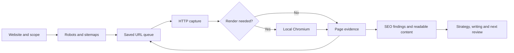

<p align="center">
  
</p>

<p align="center">
  <strong>Understand your website. Strengthen your answers. Build evidence people can trust.</strong><br>
  A complete SEO workflow with its own crawler, reputation system and specialist playbooks.
</p>

<p align="center">
  <a href="https://github.com/beyondtahir/beyondseo/actions/workflows/tests.yml"></a>
  <a href="CHANGELOG.md"></a>
  <a href="docs/setup.md"></a>
  <a href="docs/questions.md#does-it-need-tokens-apis-or-paid-scraping-services"></a>
  <a href="docs/validation.md"></a>
  <a href="LICENSE"></a>
</p>

<p align="center">
  <a href="#quick-start"><strong>Quick start</strong></a> ·
  <a href="docs/agent-installation.md"><strong>Install the skill</strong></a> ·
  <a href="docs/README.md"><strong>Documentation</strong></a> ·
  <a href="docs/questions.md"><strong>Questions & examples</strong></a> ·
  <a href="#about-the-creator"><strong>About</strong></a>
</p>

---

## Your complete SEO house

BeyondSEO connects the work that normally gets scattered across separate audits, content briefs, backlink spreadsheets and follow-up reports. Give it a website and a business goal. It helps you inspect the site, understand the gaps, compare relevant competitors, write useful content and build a practical improvement plan.

**SEO · AEO · GEO · Entity · Authority · Reputation · Local visibility · Backlinks · Conversion**

The native Python engine gathers evidence. The reusable skill brings specialist methods and business context. Together, they support the work from the first crawl to the next review.

<table>
<tr>
<td width="50%" valign="top">
<h3>01 · Inspect the website</h3>
<p>Read sitemaps, raw HTML and JavaScript content. Keep page text, metadata, schema observations, links and access evidence.</p>
</td>
<td width="50%" valign="top">
<h3>02 · Explain what matters</h3>
<p>Turn findings into clear priorities. Connect technical problems, unanswered questions and missing proof to the customer's journey.</p>
</td>
</tr>
<tr>
<td width="50%" valign="top">
<h3>03 · Build answer-ready content</h3>
<p>Draft useful answers, service pages, FAQs, internal links and factual schema. Strengthen organization identity and topical depth.</p>
</td>
<td width="50%" valign="top">
<h3>04 · Verify reputation</h3>
<p>Check real backlinks and page mentions. Review sources, distinguish ownership and calculate a conservative evidence score.</p>
</td>
</tr>
<tr>
<td width="50%" valign="top">
<h3>05 · Make the plan actionable</h3>
<p>Compare named competitors and create a 30/60/90-day roadmap with priorities, dependencies and acceptance checks.</p>
</td>
<td width="50%" valign="top">
<h3>06 · Improve and review</h3>
<p>Compare fresh snapshots, run bounded review loops and apply reviewed text-file changes with backups on compatible hosting.</p>
</td>
</tr>
</table>

[Explore every capability →](references/capabilities.md)

## Quick start

You need **Python 3.10+** and Git. Python **3.12** is recommended. Run these commands in a terminal:

```sh
git clone https://github.com/beyondtahir/beyondseo.git
cd beyondseo
python3 scripts/setup.py
python3 scripts/run.py crawl https://example.com --out ../client-runs/example --max-pages 10
```

Setup creates an isolated environment, installs the local engine, downloads Chromium and checks that it launches. The launcher automatically uses that environment, so you do not need to activate it each time.

<details>
<summary><strong>Windows PowerShell</strong></summary>

```powershell
git clone https://github.com/beyondtahir/beyondseo.git
cd beyondseo
py -3 scripts/setup.py
py -3 scripts/run.py crawl https://example.com --out ../client-runs/example --max-pages 10
```

Activation and a PowerShell execution-policy change are unnecessary when using the launcher.

</details>

<details>
<summary><strong>Linux browser dependencies or HTTP-only setup</strong></summary>

Minimal Linux systems may need Chromium's system packages. After setup has created `.venv`, use:

```sh
.venv/bin/python -m playwright install-deps chromium
python3 scripts/setup.py
```

For initial-HTML crawling without a browser:

```sh
python3 scripts/setup.py --http-only
python3 scripts/run.py crawl https://example.com --out ../client-runs/http --mode http
```

</details>

Open `../client-runs/example/report.md` for crawl findings and `readiness.md` for the next questions to review. Check `summary.json` for limits before interpreting results. A complete strategic audit follows the skill workflow below.

**No required crawling-service account. No SEO-data subscription. No API key for the native engine.** The CLI makes no language-model calls and consumes no model tokens. When an assistant analyzes evidence or writes copy, its own model usage still applies. [Costs and requirements](docs/questions.md#does-it-need-tokens-apis-or-paid-scraping-services).

[Full setup and troubleshooting →](docs/setup.md) · [Try the included practice website →](examples/README.md)

## Use it in your assistant

BeyondSEO uses a portable `SKILL.md` with bundled scripts, references and playbooks. Choose your host in the [installation guide](docs/agent-installation.md).

| Host | Where to begin |
|---|---|
| Claude Code | Install the folder under `.claude/skills`; invoke `/beyondseo` |
| Codex | Install under `.agents/skills`; invoke `$beyondseo` or select the skill |
| ChatGPT Work | Use the local folder workflow or available skill controls; cloud execution has separate requirements |
| Hermes Agent | Install in the active profile's skills directory; invoke `/beyondseo` |
| OpenClaw | Install in the active workspace or shared skills directory; select BeyondSEO |
| Terminal / Python | Run the native engine directly, or import `Config` and `Crawler` |

For example, from this checkout, install a personal Claude Code skill:

```sh
python3 scripts/install_skill.py --dest "$HOME/.claude/skills/beyondseo"
python3 "$HOME/.claude/skills/beyondseo/scripts/setup.py"
```

The installer preserves existing destinations and offers `--dry-run`. Use one intended location per host. Remote workers need their own accessible files and runtime. [Exact paths, commands and acceptance checks →](docs/agent-installation.md)

### Ask for the whole engagement

```text
Use BeyondSEO to audit https://example.com.

We are based in Pakistan and serve clients in India, the UK, Europe
and Gulf countries. Explain where our website is strong, what is missing
and which improvements matter most for our actual services.

Include technical SEO, answer readiness, entity and authority work,
verified backlink evidence, three relevant competitors, useful content
drafts and a 30/60/90-day plan. Show uncertainty and give each task a
clear way to check the result.
```

A general website audit includes reputation evidence, named competitor comparisons and a practical plan by default. A focused writing or technical question keeps its narrower scope. [More questions you can ask →](docs/questions.md#what-should-i-ask-first)

## Why choose BeyondSEO?

| What matters | How BeyondSEO helps |
|---|---|
| One connected workflow | Technical analysis, content, answer readiness, reputation, competitors and follow-up share the same evidence |
| A crawler you can inspect | The Python source, request limits, extraction logic and saved observations are available together |
| Clear answers for clients | Reports explain what was found, why it matters and what to do next in everyday language |
| Useful content, not just recommendations | The skill can draft titles, answer sections, FAQs, schema and supporting copy using verified facts |
| Reputation with evidence | Actual links, mentions, ownership and unreadable candidates remain distinguishable |
| Conservative scoring | Unknown evidence cannot quietly become a high authority claim; clients and competitors use identical rules |
| Work you can continue | Saved snapshots, source lists, review plans and guarded edits support the next round of improvement |

BeyondSEO is a strong fit for evidence-based SEO engagements. It makes no unmeasured speed, ranking or accuracy claim against another crawler.

## How our crawler works



1. **Discover:** start from the URL, inspect robots and sitemaps, and collect in-scope links.
2. **Read:** fetch raw HTML and render JavaScript when automatic mode detects the need, or when browser mode is requested.
3. **Extract:** collect main text, Markdown, titles, headings, descriptions, canonicals, hreflang, images, links and JSON-LD observations.
4. **Explain:** retain errors, redirects, access decisions, incomplete rendering and coverage limits alongside findings.
5. **Continue:** save the queue in SQLite so an unfinished snapshot can resume. Start a fresh folder to measure changes later.

BeautifulSoup parses HTML; Colorama styles terminal feedback; optional Playwright runs local Chromium. The crawling workflow is implemented in this repository. No hosted scraping backend or external agent skill is required.

| Mode | Use it when |
|---|---|
| `auto` | Starting a general crawl; it uses HTTP first and heuristic browser fallback |
| `browser` | Important text or links arrive through JavaScript, even when the initial HTML already contains text |
| `http` | Inspecting the initial server response or running without Chromium |

Automatic mode is a heuristic. Browser mode supports visible-selector waits and bounded scrolling; neither guarantees every interactive state was captured. Robots rules are respected by default. An explicit owner-authorized override is recorded, but it does not bypass authentication, CAPTCHAs or server denials.

[Browser behavior →](docs/browser.md) · [Architecture and Python interface →](docs/architecture.md) · [All CLI options →](references/crawler.md)

<details>
<summary><strong>Useful crawler commands</strong></summary>

```sh
# Render an article and wait for its visible content.
python3 scripts/run.py scrape https://example.com/article \
  --out ../client-runs/article --mode browser --wait-for-selector article --scroll-steps 5

# Capture a browser viewport image.
python3 scripts/run.py scrape https://example.com --out ../client-runs/visual --screenshot

# Include an observed www alias when it is part of the website.
python3 scripts/run.py crawl https://example.com --allow-host www.example.com \
  --out ../client-runs/site --max-pages 25

# Continue that same snapshot with a larger budget.
python3 scripts/run.py crawl https://example.com --allow-host www.example.com \
  --out ../client-runs/site --max-pages 100 --resume
```

A resume keeps semantic settings and does not refresh completed pages. Choose a new folder for a new observation.

</details>

## Our backlink and reputation system

A reputation plan should distinguish a real link from a name in a snippet, a company profile from independent recognition, and an unreadable candidate from verified evidence.

BeyondSEO prepares a **five-page discovery budget**, imports saved search-result HTML or candidate CSVs, then uses the native crawler to inspect source pages. The CLI verifies and scores supplied candidates; live search discovery uses available search/browser access or files you provide.

```sh
python3 scripts/run.py search-plan --target https://example.com \
  --brand "Example" --pages 5 --out ../client-runs/discovery

python3 scripts/run.py reputation --sources sources.csv --target https://example.com \
  --brand "Example" --max-sources 50 --out ../client-runs/reputation
```

### A score you can explain

The **BeyondSEO Reputation Score** uses supported source-quality points and explicit evidence factors. Repeated publishers are grouped; owned or affiliated sources cannot establish independent editorial proof. Every review can retain its rationale and source.

- **Low confidence:** provisional headline and adjusted range stay below **50/100**.
- **No conclusive checks:** withhold the headline.
- **Client or competitor:** the same criteria apply; uneven evidence cannot support a numerical winner.
- **Five pages:** an observed sample, never a whole-web backlink total.

The score is our own evidence measure. It is not a proprietary provider's authority score, a search-engine ranking factor or an AI-citation prediction.

[Plain-language scoring guide →](docs/scoring-explained.md) · [Complete formula and verification workflow →](references/reputation.md)

### The source library is included

The original library preserves **27 exact source URLs across six publishing platforms and nine topic categories**, with **seven additional researched reputation routes** in a separate directory.

| Platform | Saved source URLs |
|---|---:|
| Medium | 6 |
| Forem | 13 |
| Dev.to | 3 |
| Substack | 3 |
| WebYourself | 1 |
| Blogspot | 1 |

These are source/example articles and prospect routes, not 27 guaranteed client backlinks or independent endorsements. A useful plan selects relevant exact URLs, explains the contribution to make, identifies the client page to support and gives a verification step. It can also research suitable niche, industry and local opportunities.

[Browse the original source catalog →](docs/backlink-source-catalog.md) · [Reputation prospects →](docs/reputation-prospects.md) · [Growth workflow →](playbooks/backlink-system/reputation-growth-plan.md)

## What a complete audit delivers

| Deliverable | What it should contain |
|---|---|
| Friendly executive report | The three most useful next actions, business context and evidence limits |
| Technical and content review | Observed URLs, findings, affected journeys and proposed fixes |
| AEO / GEO / entity review | Answer gaps, source-worthiness, factual identity and proof requirements |
| Competitor comparison | Named pages, specific differences and opportunities grounded in comparable evidence |
| Reputation assessment | Verified backlinks, separate mentions, source reviews, conservative score and prospects |
| Useful copy | Finished drafts for the requested pages or sections, with unsupported facts flagged |
| 30/60/90-day plan | Priorities, owners, dependencies, measures and acceptance checks |
| Follow-up baseline | Saved crawl and source evidence for the next review |

The engine produces crawl evidence and technical reports. The complete skill uses that evidence with market context, specialist methods and any supplied performance data. It does not invent traffic, search volume, rankings or AI citations when those measurements are unavailable.

[Audit delivery standard →](references/audit-delivery.md) · [Complete plan template →](playbooks/templates/complete-seo-plan.md)

<details>
<summary><strong>Inside a saved crawl</strong></summary>

```text
client-runs/example/
├── report.md          Crawl findings
├── readiness.md       Search and answer-readiness review
├── summary.json       Version, counts, settings and coverage
├── access.json        Requests, restrictions and stop reasons
├── documents.jsonl    Readable content and its representation
├── content/           Page Markdown and text
├── pages.jsonl        Detailed raw/rendered observations
├── pages.csv          Page inventory
├── links.csv          Observed links and checked destinations
├── issues.json        Finding candidates and actions
├── html/              Captured raw and rendered HTML
├── screenshots/       Optional viewport images
└── crawl.sqlite3      Saved URL queue and results
```

Keep client evidence and credentials outside this repository.

</details>

## Where you can use it

**Agencies and consultants:** organize audits, source reviews, content briefs and client plans around one repeatable workflow.

**Founders and in-house teams:** understand what the website communicates, what prospects still need answered and which changes to make first.

**Developers:** inspect raw/rendered differences, metadata, sitemap coverage, access behavior and broken journeys using saved evidence.

**Content and reputation teams:** draft useful answers, strengthen entity consistency, build credible proof and review relevant third-party opportunities.

**Researchers and educators:** inspect the source, practice with local fixtures and learn where crawl evidence ends and interpretation begins.

Use it on local hardware or a suitable remote environment with Python, permitted network access and optional Chromium. Host discovery and execution support vary; see [the tested compatibility record](docs/validation.md).

## Keep improving

Compare fresh snapshots or run a bounded `watch` review. For compatible websites, stage a single local/SFTP/FTPS text-file change, inspect the diff, apply the reviewed plan within your authorization and retain a backup for rollback.

The watch command collects evidence. The skill uses it to recommend subsequent work. An ongoing schedule needs the host's scheduler; CMS/database edits and build deployments need their own suitable workflow.

[Review loops, hosting setup and guarded edits →](docs/operations.md)

## Tested scope and project status

BeyondSEO **2.4.0** is a **beta**. The local release suite passed **110 behavioral tests** on Python 3.12/macOS, covering HTTP and browser crawling, reputation scoring, installer behavior, reporting and local SFTP/FTPS fixtures. A clean installation captured JavaScript content and reproduced a saved reputation assessment.

Codex's actual skill discovery and Hermes's actual skill/reference loader passed local checks without model requests. Full assistant runs across every listed host have not been certified. The workflow badge at the top links to current GitHub CI results; the [validation record](docs/validation.md) separates local, hosted and host-specific evidence.

We welcome reproducible reports of limits and failures. There are no claims of universal access, complete web-wide backlink coverage or guaranteed search/AI rankings.

## Documentation and support

| Start here | Go deeper |
|---|---|
| [Installation and troubleshooting](docs/setup.md) | [CLI reference](references/crawler.md) |
| [Assistant setup](docs/agent-installation.md) | [Architecture / Python](docs/architecture.md) |
| [Capabilities and example questions](docs/questions.md) | [Complete capability map](references/capabilities.md) |
| [Backlink source library](docs/backlink-source-catalog.md) | [Reputation methodology](references/reputation.md) |
| [Answer and entity workflow](playbooks/core/seo-house-workflow.md) | [Measurement boundaries](references/measurement-boundaries.md) |
| [Review and improve](docs/operations.md) | [Validation](docs/validation.md) |

[Documentation index](docs/README.md) · [Changelog](CHANGELOG.md) · [Report a bug](https://github.com/beyondtahir/beyondseo/issues/new?template=bug.yml) · [Request a feature](https://github.com/beyondtahir/beyondseo/issues/new?template=feature.yml) · [Contributing](CONTRIBUTING.md) · [Security](SECURITY.md)

## About the creator

**BeyondSEO is created and maintained by Muhammad Tahir Ashraf, known as Beyond Tahir.**

Based in Pakistan, Tahir works across AI consulting, development and practical training. Through Beyond Tahir and Beyond Tahir Academy, he helps people and organizations understand AI and put it to work. Learn more about his work at [beyondtahir.com](https://beyondtahir.com).

BeyondSEO brings that practical approach to search: inspect the real website, make the evidence understandable, create useful improvements and review the result. Its purpose is to help people carry out a complete SEO engagement with clarity and control.

### Stay connected

<p>
  <a href="https://beyondtahir.com"></a>
  <a href="https://instagram.com/beyondtahir"></a>
  <a href="https://www.youtube.com/@beyondtahir"></a>
  <a href="https://linkedin.com/in/beyondtahir"></a>
</p>

[Website](https://beyondtahir.com) · [Instagram](https://instagram.com/beyondtahir) · [YouTube](https://www.youtube.com/@beyondtahir) · [LinkedIn](https://linkedin.com/in/beyondtahir) · [Academy](https://academy.beyondtahir.com)

---

Copyright © 2026 **Muhammad Tahir Ashraf — Beyond Tahir**. Released under the [MIT license](LICENSE). You may use, modify and redistribute the project under its terms. Keep the copyright and license notice. Dependency notices are in [THIRD_PARTY_NOTICES.md](THIRD_PARTY_NOTICES.md).
